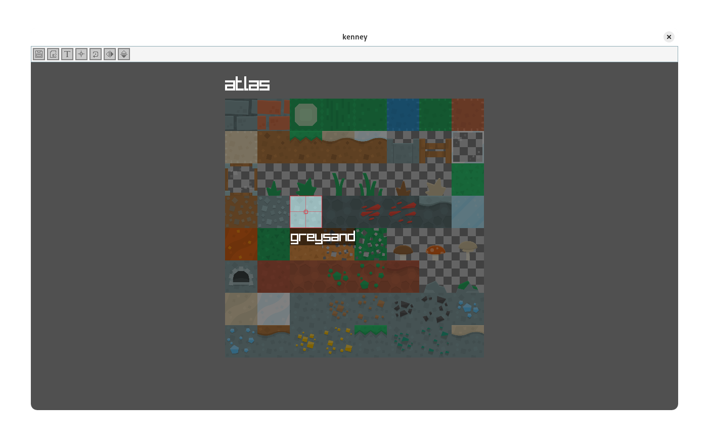

<h1 align="center">Sprite Bundler Redux</h1>

<div align="center">

</div>

<p align="center">
<
    <a href="#what-is-this">Description</a> |
    <a href="#compiling">Compiling</a> |
    <a href="#how-to-use">How to Use</a> |
    <a href="#questions-and-answers">Q&A</a>
>
</p>

### What is this?

---

> [!NOTE]
> LSPP is in early development and a lot of UI and code is very 'first pass' and `may` get a further pass to clean everything up.

Sprite Bundler Redux is a ground up rewrite of my old [Sprite Bundler](https://github.com/lxmcf/sprite-bundler) now rewritten in [Odin](https://odin-lang.org/) instead of C!

The original sprite bundler ballooned from a simple project that would easily fit into a single C file to a more complex project driven tool that became unmanagable (Plus I broke it while refactoring), this version maintains the same; and even massively expands on the originals functionality.

Sprite Bundler Redux can be used to combine several individual textures into 1 or even multiple texture atlas' with source coordinates, origin points and even simple animation frames embeded into a single file to avoid texture swapping with API's for multiple frameworks and even languages. This tool may be more advanced than its original however it is still intended for small games/game james.

### Compiling

---

> [!IMPORTANT]
> It is highly recommended to use make, as such I recommend installing make on Windows via [Choco](https://github.com/chocolatey/choco.git).

As this tool is built on Odin; it can simply be compiled on any supported operating system such as Windows, Linux, MacOS, etc...

#### With `make` (Recommended):
```shell
make run BUILD_RELEASE
```

#### Without `make`:
```shell
# Unix
odin build src/ -out:application -collection:bundler=src -vet -min-link-libs -strict-style -o:speed

# Windows
odin build src/ -out:application.exe -collection:bundler=src -vet -min-link-libs -strict-style -subsystem:windows -o:speed
```

> [!NOTE]
> Only Windows 11 and various Linux distro's have been tested.

### How to Use

---

- Manage sprites
    - Click a sprite to select it
    - Press `V` to start editing the sprite origin and `LEFT CLICK` to set
    - Press `Z` to center the origin of the selected sprite
    - Press `CTRL + R` to rename the selected sprite
    - Press `CTRL + Y` to deete the selected sprite

- Add files to currently open atlas
    - Drop desired files over window, sprites will be sorted and packed automatically

- Manage texture atlas'
    - Press `CTRL + N` to create a blank texture atlas (All atlas' will be the same size)
    - Press `CTRL + [` or `CTRL + ]` to navigate between atlas'
    - Press `CTRL + R` with no sprite selected to rename the current atlas
    - Press `DELETE` to delete the current atlas

- Camera controls
    - Press `Z` to center camera and reset zoom
    - Middle click or hold `LEFT ALT` and move mouse to pan
    - Scroll wheel to zoom

### Questions and Answers

#### Q) Why Odin?
Why not, I have been working in nothing but C for well over 12 months now and always looking to branch out.

#### Q) Why not just update the old version?
As I mentioned earlier, it ballooned too much and by the end was poorly coded with next to no string safety and a hand full of memory leaks, it would be less work to completely rewrite than refactor and update.

#### Q) What are all the different file extensions for?
- *.lspp - Lxmcf Sprite Packer Project
- *.lspx - Lxmcf Sprite Packer Bundle

#### Q) How do I actually use the sprite bundle in a project?
You can find some basic loaders in the [loaders](/loaders) directory, alternatively a simple guide on [making a loader](/docs/make-loader.md) is available!

#### Q) What does each executable do?
- lspi - Lxmcf Sprite Packer Inspector - A CLI tool to insect bundles and extract data
- lspp - Lxmcf Sprite Packer Program - The main application

#### Q) Why is the bundle file size larger than the raw images?
I did use compression on the texture atlas data ([PNG Data](http://www.libpng.org/pub/png/)) however this was removed due to instability hence a large file size, however the bundle will also store some arbitrary [FourCC style](https://en.wikipedia.org/wiki/FourCC) codes to easily identify where an atlas or sprite are in the exported bundle. Data to identify the position of the sprite in the atlas, it's origin point and animation frames are also stored, you can view the [bundle structure](/docs/bundle.md) for more info.

#### Q) How efficient is the texture packing?
Very! I have not bench marked anything but I am using [stb rect pack](https://github.com/nothings/stb) which is infinitely more robust than my initial 'MassWidthSort' method...

#### Q) What is coming next?
Not a lot... Or maybe lots; I don't know, you can check the [roadmap](/ROADMAP.md)!

#### Q) Are the new sour skittles better than the old ones?
No :slightly_smiling_face:
